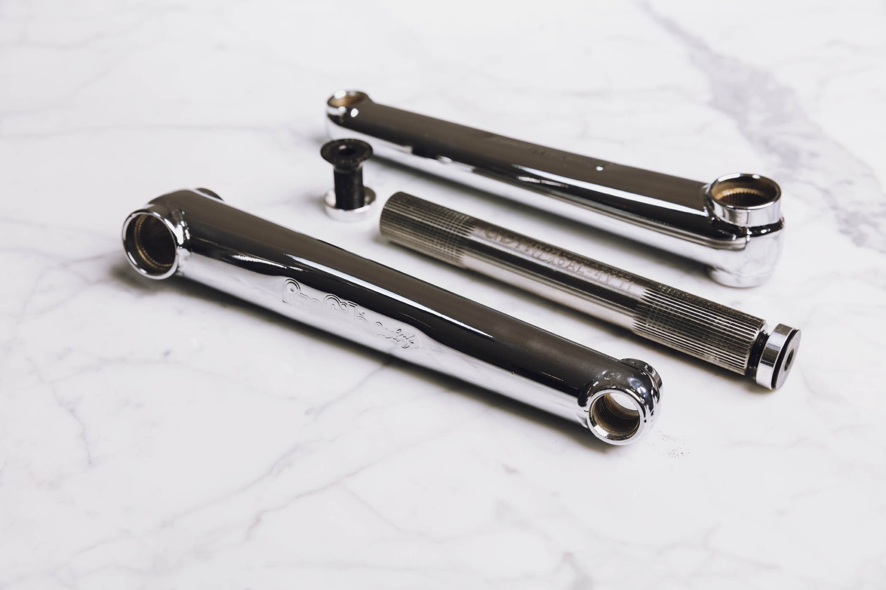
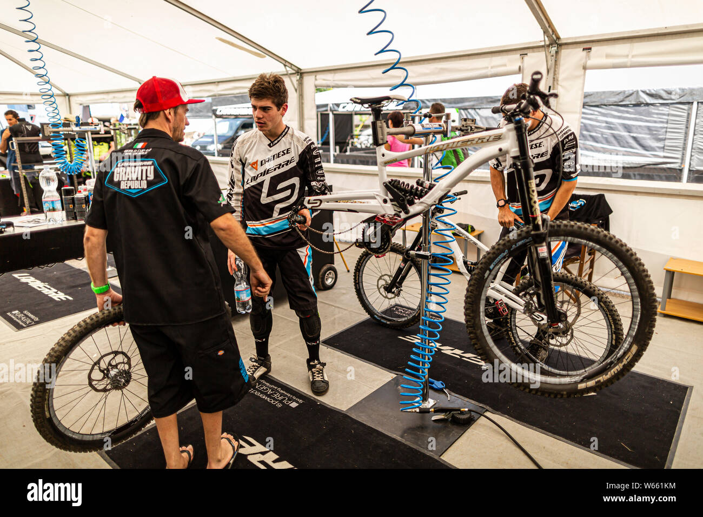
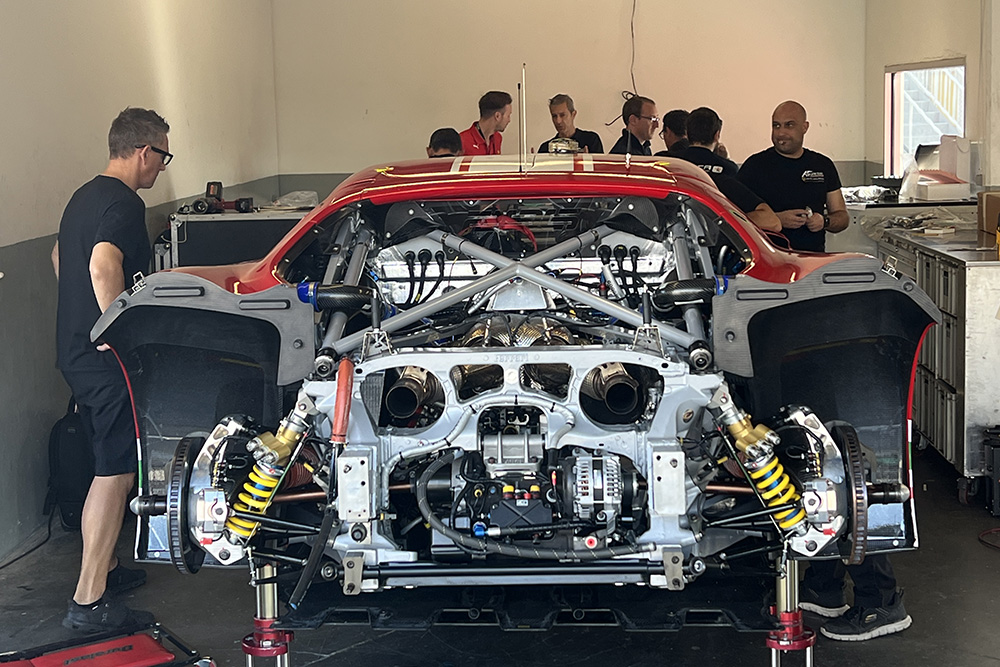

## "Fast, Strong, Cheap"

There is an old adage - strong, light, cheap: pick two. Apparently attributed to Keith Bontrager, although I've heard similar phrases (fast, cheap, good) in other contexts so I have my doubts it was wholly original. Regardless, it's a useful way to think about what is really important to you.

I never really subscribed to the lightweight aspect of mountain biking. When I started in the late 90s, the 'cool' kids were already bragging about who had a heavier freeride machine. Fourty-pound hardtails were common and talked about like badges of honor. Everyone knew only the nerdy XC racers worried about lightweight components, although everyone agreed that titanium was still cool.

All the cool people were freeriding and freeride broke everything, so buying the cheapest and or heaviest parts you could was the way to go. I ran BMX flat pedals and really wanted the Profile cranks that people had figured out how to retrofit to a mountainbike bottom bracket - not that I'd ever broken a BB before but they just looked so cool.

_They honestly still look amazing, just look at that polished steel_

## The interregnum

In the years (alright, nearly decades) that I stopped riding, the freeride community became the downhill and enduro communities, which then both became more focused on racing and once again started to worry about weight. Just as I was coming back into the fold in 2022, there were more and more part failures resulting in downtime, injuries, and missed podiums. People were starting to question whether scraping grams back was worth increasing the chance of failure.

_Those pits setups aren't just for emergencies, they churn through components each weekend_

These same ideas play out in other industries. In motorsport you can find things that work amazingly but require a full rebuilt or replacement after a race, or are completely replaced multiple times over the course of a race or session. The parts perform at an extremely high level, but without professional resources and a team to back them, they're a nightmare to live with for a normal person.

_Tires last on average just two hours (at over $3000 a set), thankfully the brake pads, and most of the fluids might last a whole session before needing replacement_

In those industries, there are more consumer-grade (or "prosumer") options that strike a better balance; with maybe 95% of the performance but with a much more tolerant wear or maintenance window that fits with what a normal person can tolerate. The same thing was happening with bikes - parts that needed to be rebuilt after a single race run, or things that were completely replaced multiple times over a weekend. Downhillers were still pushing the idea of aluminum rims, but they were also going through multiple sets of wheels per weekend. They were ( and still are!) getting brand new chains or brand new whole drivetrains too.

## Optimize for time

At this stage in my life, the number one resource for me is time. Any opportunity I have that can buy time back in exchange for weight, or money, I'll generally take (within reason). A shock that performs slightly better but requires multiple rebuilds a year? Not useful to me. Tires that are super sticky but fall off after just a few dozen kilometers? No thanks.
